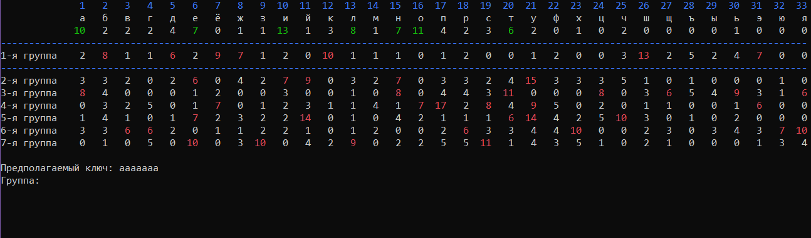
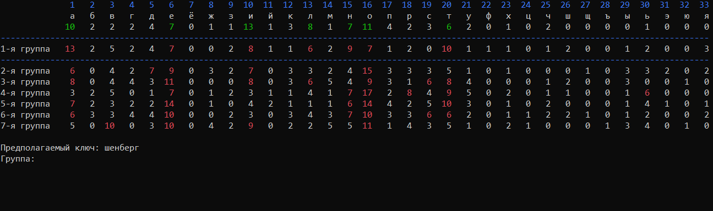

# Vigener

<p align="center">
  
</p>

Проект предназначен для удобного восстановления ключа по шифртексту, полученному при помощи шифра [Виженера](https://en.wikipedia.org/wiki/Vigen%C3%A8re_cipher).

## Building

Для компиляции проекта необходима система сборки CMake версии не ниже 3.19.2, которую можно скачать на [официальном сайте](https://cmake.org/).
```shell
> mkdir build && cd build
> cmake ..
> cmake --build . --config [Debug | Coverage | Release]
```

## Usage

```shell
> Vigener -h
Использование: Vigener -i [путь к файлу с шифртекстом] -ia [путь к файлу с аналитическим текстом]

Параметры:

-i  Задает путь к файлу с шифртекстом
-ia Задает путь к файлу с аналитическим текстом
-o  Задает путь к файлу для сохранения результата работы программы. По умолчанию - путь файла шифртекста с меткой {processed}
-a  Задает алфавит шифртекста. По умолчанию - кириллица
-af Задает путь к файлу с алфавитом шифртекста
-t  Задает порог для выделения статистики. По умолчанию 6
-k  Задает длину ключа
-mk Задает максимальную длину ключа

При вводе номера группы также можно указать следуюшие значения:

 0: выход из программы с сохранением результата работы. Ctrl + C - выход без сохранения результата
-1: вывести декодированный шифртекст при текущем ключе
-2: перейти в режим отмены сдвигов в группах. При вводе сдвига нужно указать номер группу,
для которой необходимо отменить все действия.
Для выхода из режима необходимо ввести значение 0 в поле номера группы.

При вводе сдвига группы указывается положительное или отрицательное значение для
циклического сдвига статистики вправо или влево соответсвенно.
Для выхода из текушей группы необходимо ввести значение 0 в поле сдвига.
```


## Example

В папке tests содержится файл 'Encrypted text.txt', который содержит в себе шифртекст, полученный при помощи шифра Виженера с размером ключа равным 7. Также в папке tests содержится файл 'Analytical text.txt' с аналитическим текстом.

```shell
> Vigener -i "tests/Encrypted text.txt" -ia "tests/Analytical text.txt"
```

Методом восстановления ключа является приведение распределения символов алфавита в группах шифртекста к эталонному (полученному из аналитического текста). При верном изменении распределения в группах таблица распрелений должна иметь следующий вид:

<p align="center">
  
</p>

## License

[Apache-2.0 License](LICENSE)